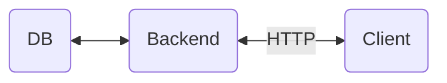

# Backend Assignment
A small - and hopefully - fun exercise

## Scenario
A backend service (`backend`) backed by a database (`db`) is serving weather data to a client (`client`) that wants to run some kind of analysis. The client-server communication should be in a RESTful manner over HTTP.



## Assignment

### You are provided with
A repository with a detailed explanation of the assignment and a dataset in CSV format containing telemetry and metadata from 5 different weather stations. The columns of the file are:
`name,serial_number,ts,key,value`

### You need to deliver
1. **Backend application**

A HTTP server with a REST endpoint that will respond appropriately to the `client` application. It should support the following parameters in order to specifically select a weather station, a time period and an aggregation function:
  - serial number: a unique string per weather station
  - start timestamp: the unix timestamp of the lower bound of the date range (inclusive)
  - end timestamp: the unix timestamp of the upper bound of the date range (exclusive)
  - aggregation type: one of `MAX` or `AVG` functions to apply per hour

The response body should be a JSON object with a schema of:
```
{
  serial_number: string,
  name: string,
  data: [{
    ts: number,
    temperature: number,
    humidity: number
  }]
}
```
2. **Client application**

An application that makes use of the `backend` API that you created and calculates which weather station had the maximum temperature and which the maximum humidity out of the 5 hourly averages per weather station for the hour [12:00, 13:00). It should print the name of the weather station and the maximum value like so
```
TEMP: Rare Blue Snowflake - 23.4
HUM: Big Red Droplet - 45
```

### Requirements
  - Everything should be containerized and wrapped in ***docker-compose*** script for easy deployment
  - Your repository should be a private clone of this one
  - All code should be available in your repository
  - Your repository should be visible to users `chatper` and `tmavroeid` when you're ready for the review

### Things to keep in mind
The assignenment is almost entirely open ended, meaning that no hard requirements were imposed on language, framework, database, schema or any technical choice really. This is intentional so that we can discuss about ***your*** choices and the approach ***you*** took to tackle this problem. Feel free to take shortcuts when you think you should. Be as detailed as possible when you deem fit. Use tools that you are comfortable with, but include some evidence in the repository if possible - even a screenshot is ok!

Happy coding
